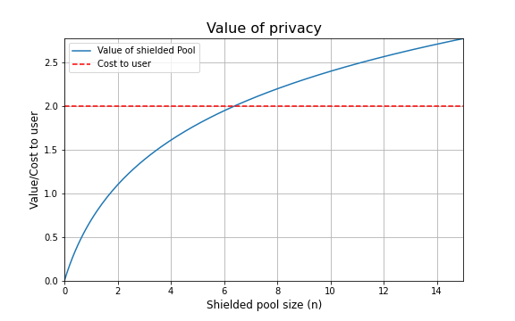
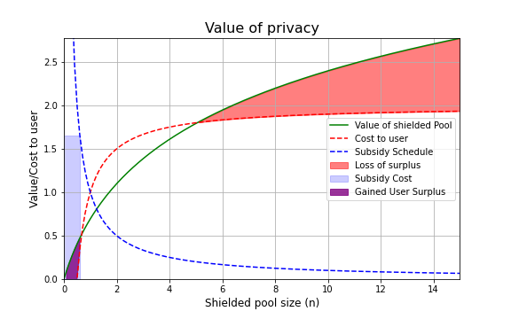
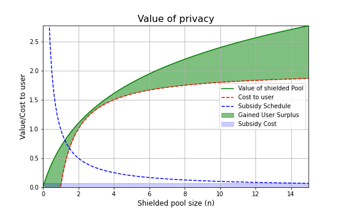

# Background and motivations

Transparency and privacy are two ends of a double edged sword. Transparency enables trust by enforcing easily-verifiable honesty, but fundamentally limits expressiveness. Any activity that cannot be publicised globally and permanently becomes inevitably supressed. Granted, for a subset of activity, this suppression may come as a feature, rather than a bug, as it forces illegal and malicious off the system. On the other hand, an arguably large subset is caught in the crossfire, ranging from medical records and political opinions to everyday transactions. As soon as there exists \textbf{one} party from which information must be withheld (on a global scale), a fully transparent model becomes unviable. We present Namada, an open-source, privacy-focused, blockchain that provides in-built optional privacy for users. Namada inherits the properties of a transparent system in being verifiable, trustless and censorship-resistant at a global scale, without sacrificing expressiveness by guaranteeing privacy by default. In this paper, we first outline the features of Namada. We then outline the stack and architecture in more detail, including high-leveled explanations for the cryptography involved. We conclude with the future roadmap and how we envisage Namada evolving.

## Privacy as a public good

In contemporary economics, a good is classified as a \textit{public good} if it is \textbf{non-rivalrous} and \textbf{non-excludable}. Put simply, a good is non-rivalrous if its consumption by one person does not prevent its consumption by another person. A good is called non-excludable if its consumption cannot be prevented by any person once it exists. 

Strictly speaking, privacy itself is not a public good because although it is not rivalrous it \textit{is} excludable. Preventing users from entering the shielded pool is trivial. However, it nonetheless exhibits a property commonly associated with public goods, namely having positive externalities. This occurs when one person's consumption of the good benefits another person, and this positive externality is indeed non-excludable. More concretely, when one user enters the shielded pool, it increases the total privacy for everyone within the shielded pool already, and it is impossible to exclude anyone already in the shielded pool from benefiting from it.

## Privacy's Positive Externality

The positive externality can be explained with a toy example (and accompanying diagram).

For the sake of simplicity, assume each "agent" in the economy is identical in terms of their preferences. We assume that the user values the opportunity to exist in a privacy set, and that the value of teh privacy set increases as the privacy set grows in size. Trivially, a privacy set of 0 people is worth nothing. Further, we assume that each additional increase in the size of the privacy set has a "decreasing marginal benefit" property, in the sense that each additional user contributes less to the overall privacy as a whole. As the privacy set grows infinitely large, the additional benefit of having someone enter the set becomes negligible. In economics, we tend to represent this through a "utility" function, that simply exists in order to measure cost and value for the agent. A natural choice for a utility function that exhibits the above properties is given by $$ U(n) = \ln (n) $$, where $n$ is the size of the privacy set. Although this is discrete, for simplicity, we will work in the continuous domain.

Additionally, we assume that there exists some unavoidable "cost" $c$ to the user for entering the privacy set. In the real world, this can correspond to learning about zero-knowledge cryptography, handling private keys, and other forms of "effort" and risks that the user may take along the journey. 

Because of the positive externality associated with entering the privacy set, there is "unrealised value" that is lost in the economy if users are unable to coordinate. Whilst no other user is in the privacy set, the value of the privacy set is 0, In contemporary economics, this "lost value" (shown by the shaded area between the value and the cost of entering) is referred to as "deadweight loss".

Therefore, if the protocol can incentivise a number of users (with ample sizes of assets) to enter the privacy set such that there is sufficient value in entering the privacy set, the coordination problem is solved. If the "social planner" was in full knowledge of exactly the amount of users needed in order to achieve this value $n^*$, she could offer exactly the correct amount of subsidy to incentives the first $n^*$ users to use the protocol and nothing more. 

We suggest an alternative approach, whereby we can claim that 

If the subsidy $s(n)$ is such that $s(n) \propto \frac{1}{n}$, then for sufficiently large constant of proportionality, the subsidy will incentivise the correct users to join the system. Additionally, this incentive scheme comes with the added benefit of being finite and predictable. This is not the only possible solution, but is one of them and seems natural.

The above subsidy is not sufficient in incentivising users to join the network, although it does lower the threshold slightly.

If we increase the incentive to be exactly proportional to the cost for the user, it suffices.

Now the point minimising the areas between the curves is given by $ \ln(x+1) - c + \frac{k}{x} = 0$ (The derivative of the integral).

This gives a set of valid points. Now, additionally, ideally, the solution is tangential to the utility curve at the intersection.

$\frac{\partial}{\partial x} \ln(x+1) = -\frac{\partial}{\partial x}\frac{k}{x} \Leftrightarrow x^2 -kx - k = 0 $

These two simultaneous equations can be solved for $k$. Alternatively, one can solve the first equation, but forcing the determinant to be zero. These two methods should give equivalent solutions.

# User Features

# Stack and Architectural Details

# Future Roadmap

